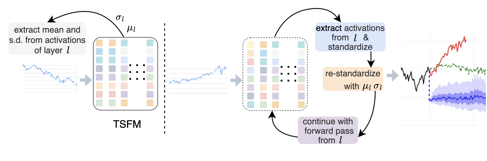

# time2time: Causal Intervention in Hidden States to Simulate Rare Events in Time Series Foundation Models

> **Abstract:**
While transformer-based foundation models excel at forecasting routine patterns, two questions remain: do they internalize semantic concepts such as market regimes, or merely fit curves? And can their internal representations be leveraged to simulate rare, high-stakes events such as market crashes? To investigate this, we introduce activation transplantation, a causal intervention that manipulates hidden states by imposing the statistical moments of one event (e.g., a historical crash) onto another (e.g., a calm period) during the forward pass. This procedure deterministically steers forecasts: injecting crash semantics induces downturn predictions, while injecting calm semantics suppresses crashes and restores stability. Beyond binary control, we find that models encode a graded notion of event severity, with the latent vector norm directly correlating with the magnitude of systemic shocks. Validated across two architecturally distinct TSFMs, Toto (decoder only) and Chronos (encoder decoder), our results demonstrate that steerable, semantically grounded representations are a robust property of large time series transformers. Our findings provide evidence for a \emph{latent concept space} that governs model predictions, shifting interpretability from post-hoc attribution to direct causal intervention, and enabling semantic \enquote{what-if} analysis for strategic stress-testing.

## 

<p align="center">
  
</p>

-----

## Installation ⚙

1. Clone the repository:
```bash
    git clone https://github.com/bharat-tsfm-consortium/time2time.git
    cd time2time
```
2. Create a virtual environment and activate it:
```bash
    # On Linux/MacOS
    python3 -m venv time2time_env
    source time2time_env/bin/activate

    # On Windows
    python3 -m venv time2time_env
    time2time_env\Scripts\activate
```

3. Install dependencies:
```bash
    pip3 install -r requirements.txt
```
-----

## Usage 📈
### Real Data
##
To generate the plots for the real data, run the following command:
```bash
    time2time_env/bin/python3 generate_real.py
```
_The plot will be saved as `stylised_real.png` in the current directory._
##

### Synthetic Data
##
To generate the plots for the synthetic data, run the following command:
```bash
    time2time_env/bin/python3 generate_synthetic.py
```

_The plot will be saved as `stylised_synthetic.png` in the current directory._
##

### Heatmap
##
To generate the heatmap, run the following command:
```bash
    time2time_env/bin/python3 generate_heatmap.py
```
